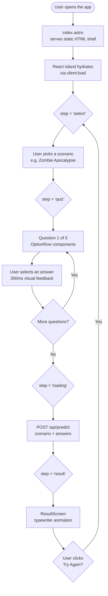
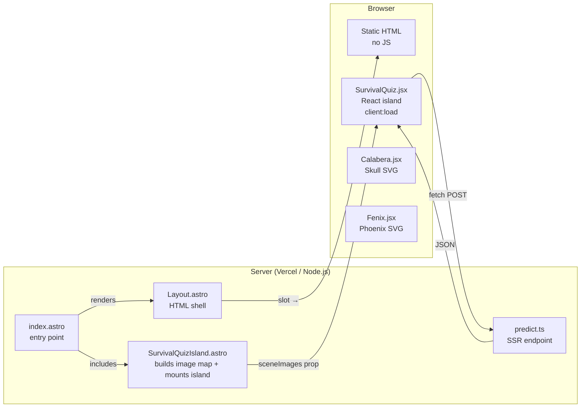
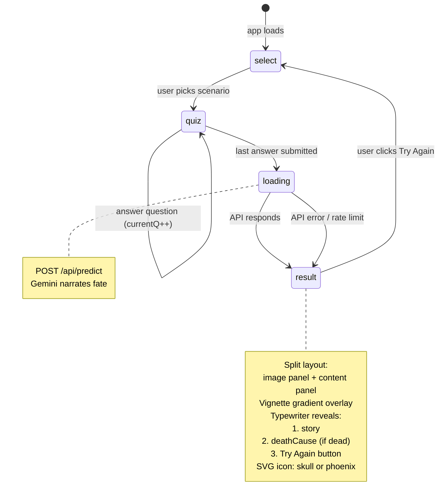
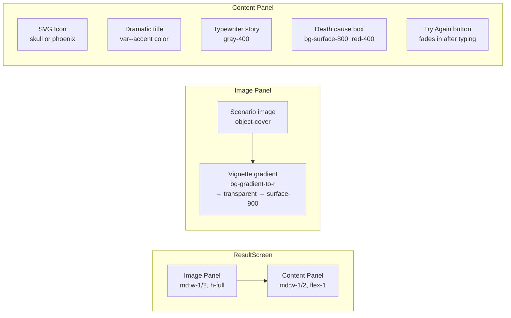
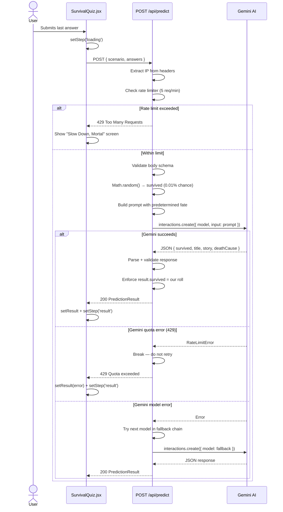
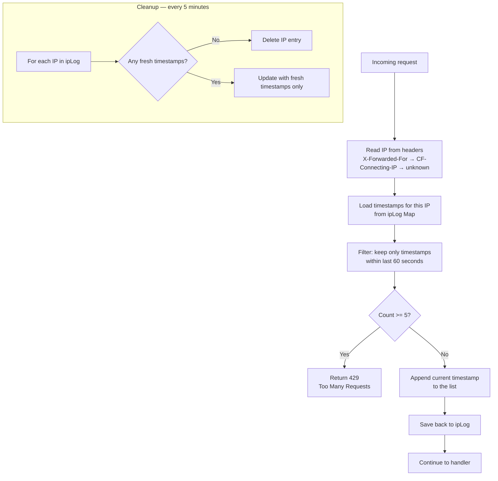
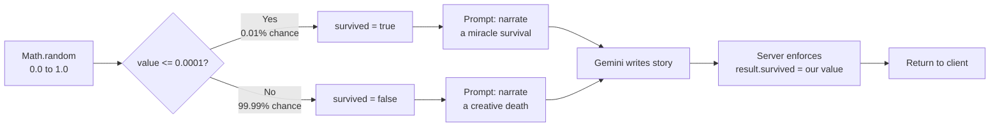

# Architecture & Flow

How "Would You Survive?" works end to end — the data flow, the decision chain, and why the pieces fit together the way they do.

---

## User Journey

The app is a linear quiz with four screens. Each screen is a different state in the React component. The user flows through them in order, and the loop closes when they hit "Try Again".



**Why this matters:** The entire UI is a state machine with four states (`select → quiz → loading → result`). There's no routing library, no URL params — just a single `step` string. This keeps the component simple and the logic predictable. Each render returns a completely different screen, so there's no stale state leaking between screens.

---

## Astro Islands — Server + Browser Separation

The page shell is pure HTML. No JavaScript reaches the browser until the React quiz component explicitly asks to hydrate. This is the **Astro Islands** pattern.



**Why this matters:** Astro renders the HTML on the server and sends zero JavaScript by default. Only the interactive quiz component — marked with `client:load` — gets hydrated on the client. The API endpoint (`predict.ts`) never leaves the server. This separation means:

- The page appears instantly (no JS blocking paint)
- The Gemini API key stays server-side forever
- The React bundle is the only JS the browser downloads

The scenario images live in `public/endings/` and are served as plain static files by Vercel's CDN. `SurvivalQuizIsland.astro` assembles the `sceneImages` map using static paths (`/endings/imagen.webp`) and mounts `SurvivalQuiz` with `client:load`. `index.astro` simply includes this island, keeping the entry point clean. The React component never imports raw image assets directly — it receives the URLs as a prop.

The project uses `output: 'server'` with the `@astrojs/vercel` adapter. Every route is server-rendered on each request — nothing is pre-rendered at build time.

---

## State Machine — Component Lifecycle

The React component uses four states. Each one maps to a distinct visual screen, and transitions are triggered by user actions or API responses.



**Why this matters:** The state machine is the backbone of the component. By keeping transitions explicit and linear, we avoid the complexity of nested conditional rendering. The loading state is especially important — it prevents double-submits and gives the user visual feedback while Gemini processes (which takes 2–5 seconds).

---

## Result Screen — Layout

The `ResultScreen` uses a **horizontal split layout**: a full-height image panel on the left and a scrolling content panel on the right.



The image panel shows the scenario image at full height with `object-cover`. On mobile it collapses to a fixed `h-64` top panel. A vignette gradient (`bg-gradient-to-t` on mobile, `bg-gradient-to-r` on desktop) softens the edge between the image and the dark content panel.

The content panel is vertically centered and contains:

1. **SVG icon** — `Calabera.jsx` (skull) when dead, `Fenix.jsx` (phoenix) when alive
2. **Dramatic title** — colored with `var(--accent)` for per-scenario theming
3. **Story** — revealed character-by-character via typewriter hook
4. **Death cause** — a `bg-surface-800` box that fades in after story typing completes
5. **"Try Again" button** — fades in (`translate-y-0 opacity-100`) only after all text is done

Key visual properties of the split-panel result screen:

| Property           | Value                                                          |
| ------------------ | -------------------------------------------------------------- |
| Image placement    | `md:w-1/2`, full height, `object-cover`                        |
| Mobile image       | `h-64` fixed height, stacked vertically                        |
| Image transition   | `hover:scale-106` on desktop                                   |
| Vignette           | `bg-gradient-to-t` (mobile), `bg-gradient-to-r` (desktop)      |
| Content max width  | `max-w-md` centered                                            |
| Death cause card   | `bg-surface-800`, fades with `transition-opacity duration-300` |
| Icon size          | `w-10 h-10` (40px) via component props                         |
| "Try Again" button | White bg, hover becomes accent color, `active:scale-95`        |

---

## API Call — How Fate Is Decided

This is the most important architectural decision in the project. **The server decides if the player survives before it calls Gemini.** The AI only narrates the outcome — it never decides it.



**Why this matters:** Letting the AI decide would give inconsistent survival rates. AI models don't follow probability instructions reliably. By rolling `Math.random()` first (99.99% death rate) and baking the outcome into the prompt, we guarantee consistency. The server also overrides `result.survived` after parsing — even if the AI ignores the instruction, the correct value wins.

The endpoint has two fallback layers:

1. **Model fallback:** If `gemini-2.5-flash` fails (except quota errors), try `gemini-3.5-flash`
2. **Rate limiter:** A sliding window prevents one user from exhausting the daily API quota in minutes

---

## Rate Limiter — Sliding Window

The free Gemini tier allows ~10 requests per minute. Without protection, a single user spamming "Try Again" could burn through it. The rate limiter uses a sliding window (not a fixed clock window) to prevent burst abuse.



**Why sliding window instead of fixed?** A fixed window resets at a specific clock boundary (e.g., every minute on the minute). A user could send 5 requests at 11:59:59 and 5 more at 12:00:01 — 10 requests in 2 seconds. The sliding window always looks at the last 60 seconds from right now, so this burst isn't possible.

---

## Survival Probability

The survival roll happens before the AI prompt is built. The threshold is intentionally brutal — 0.01% survival rate.



**Why this matters:** The prompt tells Gemini the outcome and asks it to narrate — not decide. This produces better writing because the AI commits to the story instead of hedging. The server enforces the final `survived` value regardless of what the model returned, so the 99.99% rule is absolute.

---

## SVG Icon Components

Two inline SVG components add visual distinction between death and survival outcomes.

### `Calabera.jsx`

A sugar-skull-inspired SVG icon displayed on the result screen when the player dies. It uses `fill="currentColor"` so it inherits the per-scenario accent color applied via `text-[var(--accent)]`.

**Usage in result screen:**

```jsx
<Calabera className="inline-block text-[var(--accent)]" width={40} height={40} />
```

### `Fenix.jsx`

A phoenix SVG icon displayed when the player survives (approximately 0.01% of games). Uses `fill="currentColor"` and is rendered in amber (`text-amber-400`) to visually distinguish survival from death.

**Usage in result screen:**

```jsx
<Fenix className="inline-block text-amber-400" width={40} height={40} />
```

Both components accept `className` (for Tailwind color/sizing utilities), `width`, and `height` props. Using inline SVGs instead of `` tags gives us color control via CSS, zero network requests, and the ability to animate paths (e.g., the skull's `animate-bounce` during loading).
