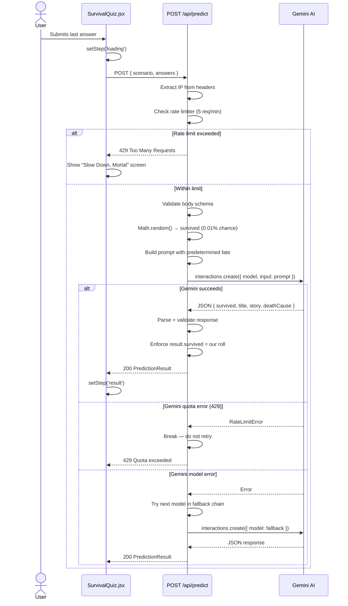
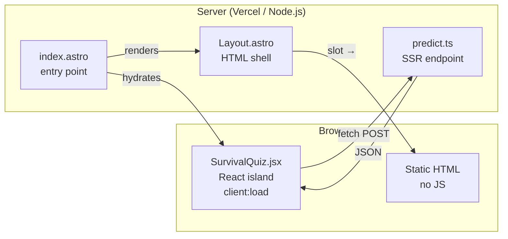
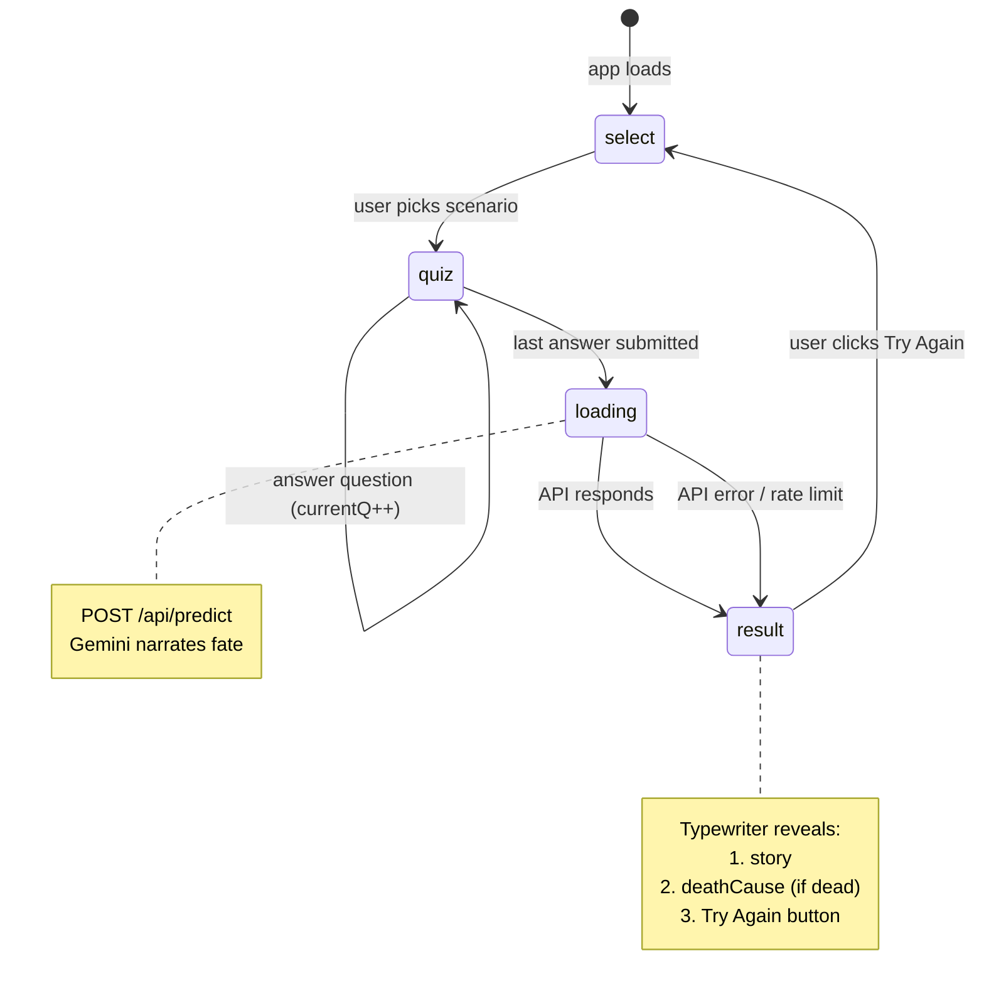
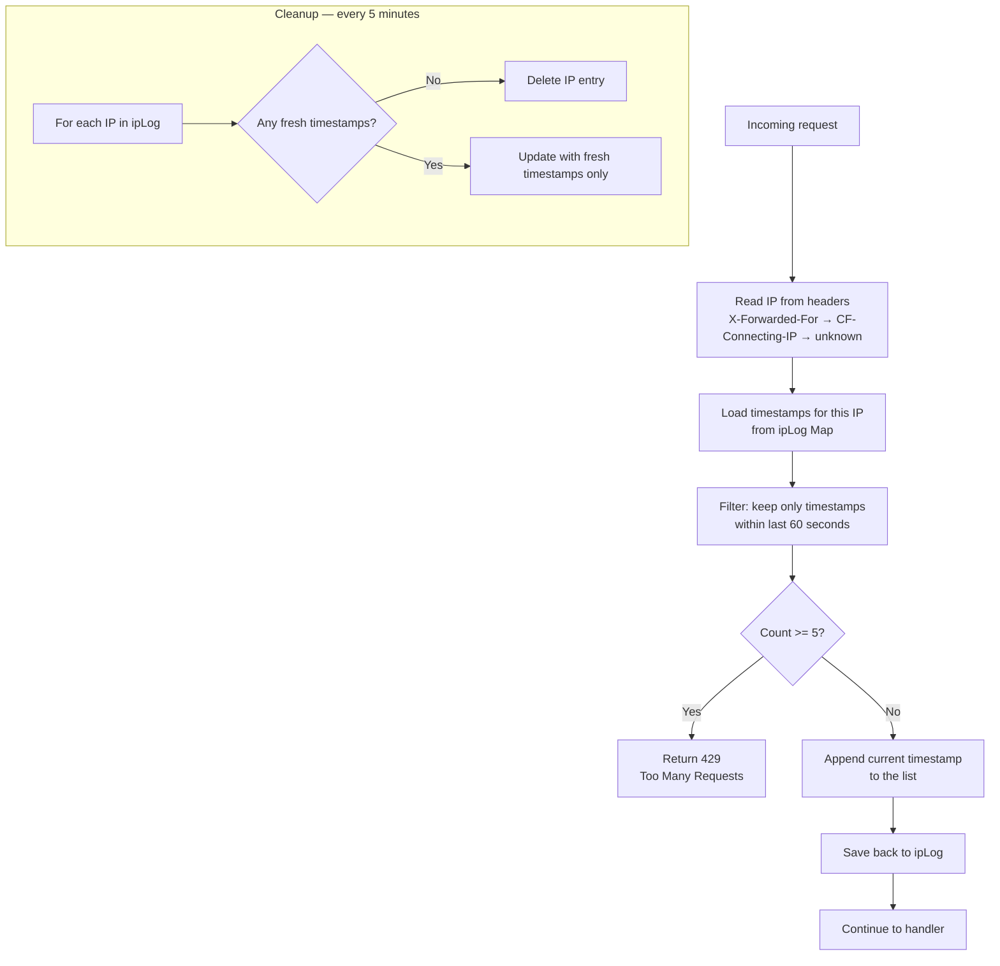
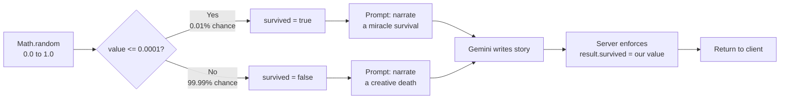

# Architecture & Flow

Visual diagrams of how "Would You Survive?" works end to end.

---

## Application Flow

---

## API Endpoint Lifecycle

---

## Astro Islands Architecture

> The project uses `output: 'server'` with the `@astrojs/vercel` adapter. Every route is server-rendered on each request — there is no static pre-rendering. The HTML shell and routing run on the Vercel edge/serverless runtime. The quiz UI runs in the browser. The API endpoint runs on the server. They share no runtime — only data contracts.

---

## State Machine

---

## Rate Limiter — Sliding Window

---

## Survival Probability Decision

