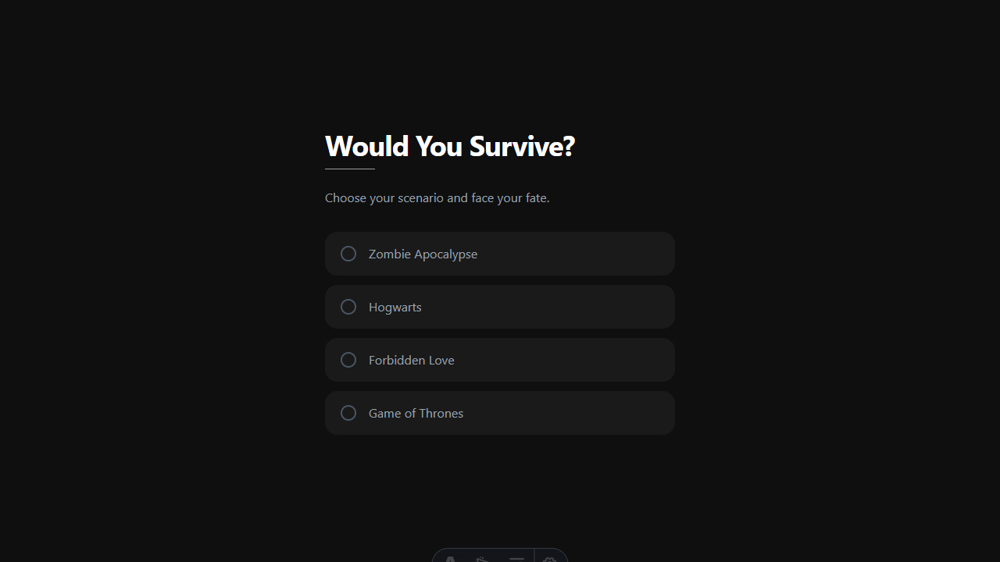
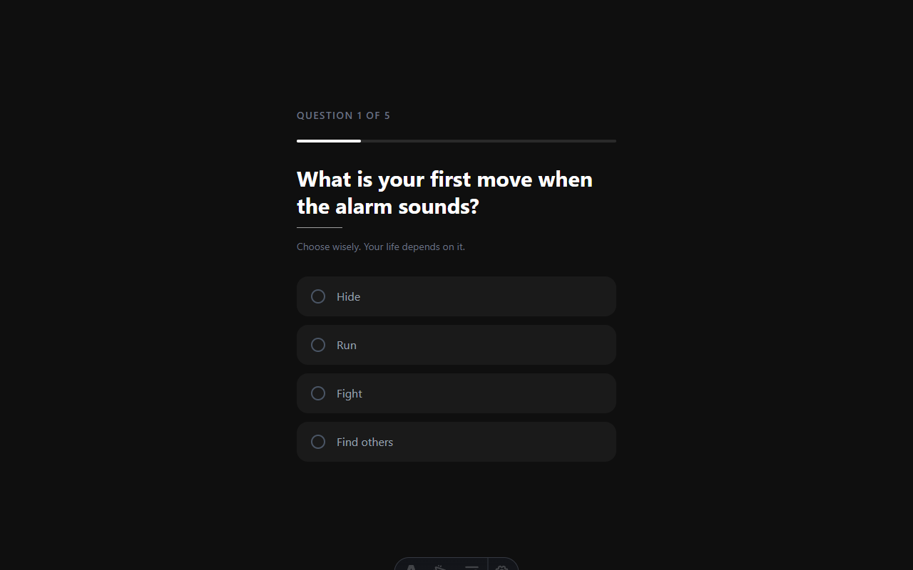
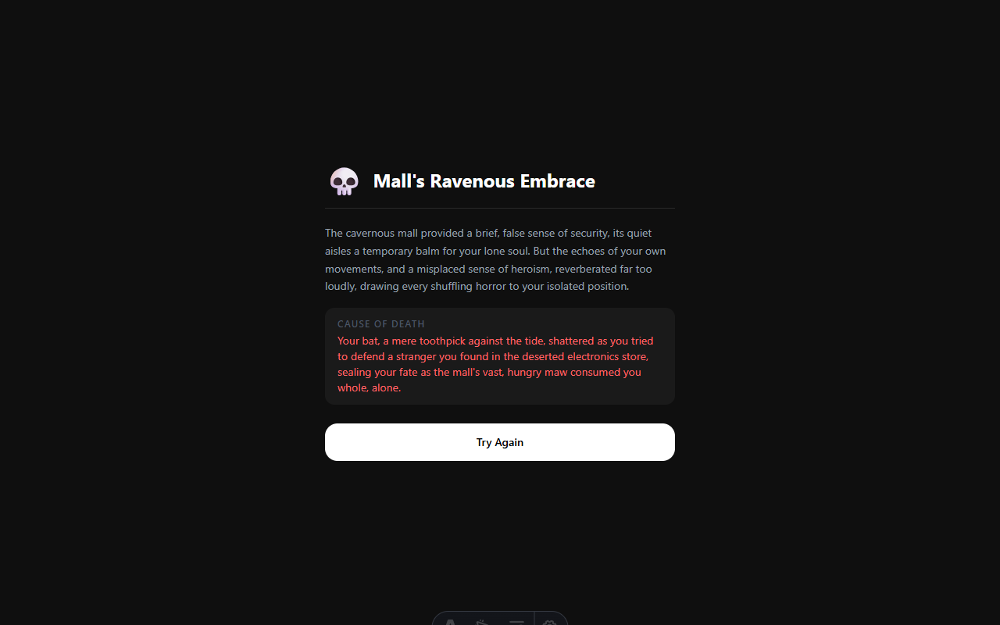

# Build an AI Survival Quiz with Astro, React & Gemini

**🏆 Codédex Project Tutorial**

> _"Would You Survive?"_ — a darkly comedic quiz where players face impossible scenarios and Google Gemini narrates their inevitable fate. Spoiler: 99.99% of players die horribly. You probably will too.

Have you ever wondered if you'd survive a zombie apocalypse? Or make it out of Hogwarts alive? This tutorial walks you through building a full-stack web app that answers that question — and dramatically explains _how_ you died.

This is not a "paste this and pray" tutorial. Every decision here has a reason — from the architecture (why Astro Islands instead of pure React?) to the AI prompt design (why do we decide the outcome _before_ calling Gemini?). You'll understand _why_ each piece exists, not just _how_ to wire it up.

By the end, you'll have a working app deployed on Vercel and you'll understand:

- Why **Astro Islands** give you React's interactivity without the JS bundle bloat
- How to build **server-side API endpoints** in Astro that securely call the Gemini API
- Why you should **pre-roll the outcome** before prompting an AI (and how to enforce it)
- How to craft **structured prompts** that reliably return parseable JSON
- How **sliding window rate limiters** work and why they beat fixed windows
- Why `public/` and `src/assets/` are not the same thing — and when it breaks your deploy

---

## What We're Building

A four-screen interactive death quiz:

```
[Choose Scenario] → [5 Questions] → [Loading...] → [Your Fate Revealed 💀]
```

Four scenarios. Five questions each. One AI judge. Zero mercy.

The player picks a scenario — Zombie Apocalypse, Hogwarts, Game of Thrones, or Forbidden Love — answers five strategic questions, and then waits while Google Gemini dramatically narrates their fate. Each scenario has its own color theme, its own image backdrop, and its own flavor of doom.



_Each scenario gets its own accent color — zombie is pale green, Hogwarts is soft blue, forbidden love is rose, Game of Thrones is gold._



_Five questions, four options each. A progress bar tracks how close you are to your doom._



_Gemini narrates your death one character at a time. The scenario image fills the left panel. You can't skip it._

Here's the tech powering this:

| Layer | Tool | Why |
|---|---|---|
| Framework | Astro 7 | SSR + Islands — ships zero JS by default |
| UI | React 19 | Interactive quiz state machine |
| Styling | Tailwind CSS v4 | Dark theme + per-scenario accent colors |
| AI | Google Gemini | Generates your dramatic death narrative |
| Deployment | Vercel | Serverless functions for the API endpoint |

---

## Prerequisites

- **Node.js 22+** — check with `node -v`
- **pnpm** — `npm install -g pnpm`
- A **Gemini API key** — free at [Google AI Studio](https://aistudio.google.com/app/apikey)
- About **90 minutes** (less if you type fast, more if you read every word)

---

## Step 0 — Project Setup

```bash
pnpm create astro@latest survival-quiz
cd survival-quiz
pnpm install
```

When the Astro wizard asks:

| Prompt       | Answer           |
| ------------ | ---------------- |
| Template     | **Empty**        |
| TypeScript   | **Yes (strict)** |
| Install deps | **Yes**          |

Now add React, Tailwind, and the Gemini SDK:

```bash
pnpm astro add react
pnpm add -D @tailwindcss/vite tailwindcss
pnpm add @google/genai @astrojs/vercel
```

### Configure Astro

`astro.config.mjs` wires together the server output mode, the React integration, the Vercel adapter, and the Tailwind Vite plugin:

```js
// @ts-check
import { defineConfig } from 'astro/config'
import tailwindcss from '@tailwindcss/vite'
import react from '@astrojs/react'
import vercel from '@astrojs/vercel'

export default defineConfig({
  output: 'server',
  adapter: vercel(),
  integrations: [react()],
  vite: {
    plugins: [tailwindcss()],
  },
})
```

`output: 'server'` is the key. Without it, Astro would pre-render every page to static HTML at build time — and our API endpoint would never run. With `server` mode, every request is handled live.

### Why `@astrojs/vercel`?

Astro is a **framework**, not a server. To run SSR in production, you need an **adapter** that translates Astro's internal server into something a hosting platform understands. `@astrojs/vercel` converts each API route into a serverless function. Netlify and Cloudflare have their own adapters — the interface is the same, the output target changes.

### Global CSS with Tailwind v4

Tailwind v4 uses `@theme` to define design tokens. This is where we declare our dark surface palette and, later, our per-scenario accent colors:

```css
/* src/styles/global.css */
@import 'tailwindcss';

@theme {
  --color-surface-900: #0f0f0f;
  --color-surface-800: #1a1a1a;
  --color-surface-750: #242424;
  --color-surface-700: #2a2a2a;
}

:root {
  --accent: #fff;
}

[data-scenario='zombie'] {
  --accent: #c5d5b8;
}
[data-scenario='hogwarts'] {
  --accent: #c4c9e8;
}
[data-scenario='doomed_love'] {
  --accent: #e8c4cd;
}
[data-scenario='got'] {
  --accent: #e8dcc4;
}

@keyframes blink {
  0%,
  100% {
    opacity: 1;
  }
  50% {
    opacity: 0;
  }
}
```

The `data-scenario` attributes will be set on the root quiz div by our React component. When the player picks "Zombie Apocalypse," every element that uses `var(--accent)` shifts to pale green — the progress bar, the radio button borders, the skull icon. The player gets a visual hint of the world they've entered before reading a single line of text.

We'll come back to the `blink` animation when we build the typewriter cursor.

### Environment Variables

Create `.env` at the project root:

```
GEMINI_API_KEY=your_key_here
```

Add `.env` to your `.gitignore`. **Never commit API keys.**

---

## Step 1 — The Scenarios (Data Layer)

All quiz content lives in one TypeScript file: `src/constants/scenes.ts`. Every scenario has a label and exactly 5 questions with 4 options each.

```ts
export const SCENARIOS = {
  zombie: {
    label: 'Zombie Apocalypse',
    questions: [
      {
        q: 'What is your first move when the alarm sounds?',
        options: ['Hide', 'Run', 'Fight', 'Find others'],
      },
      { q: 'Your weapon of choice?', options: ['Bat', 'Axe', 'Gun', 'None'] },
      { q: 'Alone or in a group?', options: ['Alone', 'Small group', 'Large group', 'Depends'] },
      { q: 'Where do you shelter?', options: ['Mall', 'Forest', 'Underground', 'Rooftop'] },
      {
        q: 'Would you sacrifice someone to escape?',
        options: ['Yes', 'No', 'Only if necessary', 'Never'],
      },
    ],
  },
  hogwarts: {
    label: 'Hogwarts',
    questions: [
      {
        q: 'Your Hogwarts house?',
        options: ['Gryffindor', 'Slytherin', 'Hufflepuff', 'Ravenclaw'],
      },
      {
        q: 'First spell you master?',
        options: ['Expelliarmus', 'Avada Kedavra', 'Lumos', 'Accio'],
      },
      { q: 'Facing Voldemort, you...?', options: ['Fight', 'Run', 'Negotiate', 'Hide'] },
      { q: 'Your magical creature companion?', options: ['Owl', 'Phoenix', 'Dragon', 'None'] },
      {
        q: 'Dark Arts: use them or refuse?',
        options: ['Use them', 'Refuse always', 'Only in emergencies', 'Learn but never use'],
      },
    ],
  },
  doomed_love: {
    label: 'Forbidden Love',
    questions: [
      {
        q: 'You fall for someone your family would never accept. What do you do?',
        options: [
          'Tell your family immediately',
          'Keep it completely secret',
          'Run away together',
          'End it before it starts',
        ],
      },
      {
        q: 'Your lover asks you to choose between them and your family. You...?',
        options: [
          'Choose your family',
          'Choose your lover',
          'Refuse to choose',
          'Ask for more time',
        ],
      },
      {
        q: 'You receive a letter saying your lover has died. Before you can verify it, you...?',
        options: [
          'Rush to confirm in person',
          'Collapse and believe it',
          'Ask someone you trust',
          'Wait for more news',
        ],
      },
      {
        q: 'The only way to be together is to fake your own death. Do you go through with it?',
        options: [
          'Yes, without hesitation',
          "No, it's too dangerous",
          'Only if they go first',
          'Find another way',
        ],
      },
      {
        q: 'Everything has gone wrong. Your last chance is a single desperate act. You...?',
        options: [
          'Do it — love is worth it',
          'Hesitate and lose the moment',
          'Walk away and survive alone',
          'Trust that it will work out',
        ],
      },
    ],
  },
  got: {
    label: 'Game of Thrones',
    questions: [
      { q: 'Your house allegiance?', options: ['Stark', 'Lannister', 'Targaryen', 'No one'] },
      { q: 'Strategy for survival?', options: ['Betrayal', 'Loyalty', 'Isolation', 'Gold'] },
      {
        q: 'Winter is coming. You...?',
        options: ['Stockpile', 'Migrate south', 'Ignore it', 'Prepare army'],
      },
      {
        q: 'The throne is yours to take. How?',
        options: ['War', 'Marriage', 'Politics', 'Dragons'],
      },
      {
        q: 'A trusted ally betrays you. You...?',
        options: ['Execute them', 'Forgive', 'Exile', 'Use it against them'],
      },
    ],
  },
}
```

Each scenario has exactly 4 questions with 4 options. Why? Consistency matters more than creativity here. The React component renders every scenario through the same loop — same progress bar, same radio buttons, same 300ms delay on answer. If scenarios had variable-length question sets, the UI would need branching logic. By fixing 5 questions × 4 options, every scenario is interchangeable.

### Why TypeScript for Plain Data?

`SCENARIOS` is consumed by two completely different runtime contexts:

1. **The React component** (browser) — renders questions and options
2. **The API endpoint** (server) — reads questions and answers to build the Gemini prompt

Without a shared type, they can drift apart. You add a `bonusQuestion` field in one and forget the other, and nothing warns you until runtime. With TypeScript, a rename or restructure is caught at compile time in both places simultaneously.

---

## Step 2 — The Layout, the Island, and Per-Scenario Theming

### The HTML Shell

```astro
---
// src/layouts/Layout.astro
import '../styles/global.css'
---

<!doctype html>
<html lang="en">
  <head>
    <meta charset="UTF-8" />
    <meta name="viewport" content="width=device-width, initial-scale=1.0" />
    <link rel="icon" href="/favicon.svg" type="image/svg+xml" />
    <title>Would You Survive?</title>
  </head>
  <body>
    <slot />
  </body>
</html>

<style>
  html,
  body {
    margin: 0;
    width: 100%;
    height: 100%;
    background-color: #0f0f0f;
  }
</style>
```

`<slot />` is Astro's equivalent of React's `{children}`. It's where page content gets injected.

### The Island Pattern

Astro's architecture is simple: **most of your page is static HTML**. Only the interactive parts ship JavaScript. Each interactive component is called an "island."

Create a bridge component that sits between Astro (server) and React (client):

```astro
---
// src/components/SurvivalQuizIsland.astro
import SurvivalQuiz from './SurvivalQuiz.jsx'

const sceneImages = {
  zombie: '/endings/zombie-apocalypse.webp',
  hogwarts: '/endings/hogwarts.webp',
  doomed_love: '/endings/forbidden-love.webp',
  got: '/endings/game-of-thrones.webp',
}
---

<SurvivalQuiz client:load sceneImages={sceneImages} />
```

This file is doing more than it looks like. Let's unpack every decision.

#### Why a separate `.astro` file instead of importing images directly in React?

You might wonder: why not just import the `.webp` files inside `SurvivalQuiz.jsx`? The React component is the one that actually renders them.

The answer is about **where each file runs**. `.astro` files run on the server. `.jsx` files with `client:load` run in the browser. If you import an image inside a React component, it becomes part of the client-side JavaScript bundle — the browser has to download it as part of your JS before it can even request the image file.

By keeping image references in the `.astro` file, we resolve the paths at **request time on the server** and pass the resulting URLs as a plain prop. The React component just receives a string like `/endings/zombie-apocalypse.webp` — it has no idea how that URL was produced. This separation means the image logic can change (CDN, optimization, etc.) without touching the component.

#### Where do the images live — and why does it matter?

The images are placed in `public/endings/`. This is intentional, not arbitrary.

In Astro with `output: 'server'`, images placed in `src/assets/` can be processed by Astro's image pipeline (resize, format conversion, content hashing). But that processing happens inside the serverless function at runtime. The problem: **on Vercel, files in `src/assets/` are not part of the deployed file system** — they only exist during the build step. Once the serverless function runs, those files are gone.

`public/` is different. Anything in `public/` is served directly as a static asset by Vercel's CDN. It never passes through a serverless function. The files are always available, always fast, and the paths never change.

The rule of thumb:

| Where to put it | When to use it |
|---|---|
| `src/assets/` | Images you need Astro to **optimize** (resize, convert format) for static pages |
| `public/` | Images that should be served **as-is** by the CDN, especially in SSR mode |

For this project, since we're running `output: 'server'` on Vercel, `public/` is the correct choice.

#### What does `client:load` actually do?

The `client:load` directive on `<SurvivalQuiz>` tells Astro: _"This component needs JavaScript. Hydrate it immediately after the page loads."_

Without it, the React component would render its HTML server-side and ship **no JavaScript to the browser** — which means no interactivity. The quiz would look correct but do nothing when you click.

Astro has several hydration directives, each with a different trade-off:

| Directive | When it hydrates | Best for |
|---|---|---|
| `client:load` | Immediately on page load | Interactive components the user needs right away |
| `client:idle` | When the browser is idle | Lower-priority widgets |
| `client:visible` | When it enters the viewport | Components below the fold |
| `client:only` | Client-side only, no SSR HTML | Components that cannot render on the server |

We use `client:load` because the quiz is the entire page — there's nothing else to load first. The user lands here to interact immediately.

#### The `sceneImages` prop bridge

Notice that `sceneImages` is built in the `.astro` file (server) and passed as a prop to the React component (client). This is the island bridge in action.

The server resolves the image paths. The client receives finished URLs. Neither side knows or cares about the other's implementation. This pattern — **prepare data on the server, pass it as serializable props to the island** — is the key to using Astro Islands correctly. Props must be serializable (strings, numbers, plain objects, arrays) because they cross the server/client boundary as JSON.

### The Entry Page

```astro
---
// src/pages/index.astro
import Layout from '../layouts/Layout.astro'
import SurvivalQuizIsland from '../components/SurvivalQuizIsland.astro'
---

<Layout>
  <SurvivalQuizIsland />
</Layout>
```

Three lines. The layout provides the HTML shell, the island provides the interactivity. That's it.

### Why Islands? Why Not Just React?

If you build this as a plain React SPA, every visitor downloads React, your quiz component, and all its dependencies — even before they click anything. With Astro Islands:

- The page shell (HTML, CSS) loads instantly with **zero JavaScript**
- React and the quiz component load **only after** the page is interactive
- Everything else on the page (if there were anything else) stays as static HTML

For this quiz — which is 100% interactive — the difference is negligible. But the pattern matters. The **discipline** of separating static from interactive forces you to think about what _needs_ JavaScript and what doesn't.

### Per-Scenario Theming (The `data-scenario` System)

Remember the CSS custom properties we set up in `global.css`? Each scenario has its own accent color via `[data-scenario="..."]`. The React component sets this attribute on the root quiz div:

```jsx
<div data-scenario={scenario} className="...">
```

When the player chooses "Hogwarts," the div becomes `<div data-scenario="hogwarts">`. The CSS fires `--accent: #c4c9e8` (soft blue), and every element that uses `var(--accent)` — the progress bar, the radio button border, the skull icon — shifts color.

We also registered semantic color tokens in `@theme`:

- `bg-surface-900` → `#0f0f0f` (deepest background)
- `bg-surface-800` → `#1a1a1a` (card backgrounds)
- `bg-surface-750` → `#242424` (hover state)
- `bg-surface-700` → `#2a2a2a` (selected state)

These aren't random hex values. The difference between each level is exactly `10` hex points (`0f → 1a → 24 → 2a`). That consistency means hover, selected, and default states always feel like they belong to the same surface — just layered.

---

## Step 3 — The Quiz Component

This is the heart of the app. Create `src/components/SurvivalQuiz.jsx`.

The component is a **state machine** with four states:

```
'select' → 'quiz' → 'loading' → 'result'
```

Each state renders a completely different screen. Here's the full skeleton with state:

```jsx
import { useState } from 'react'
import { SCENARIOS } from '../constants/scenes'
import Calabera from './Calabera.jsx'
import Fenix from './Fenix.jsx'

export default function SurvivalQuiz({ sceneImages = {} }) {
  const [step, setStep] = useState('select')
  const [scenario, setScenario] = useState(null)
  const [answers, setAnswers] = useState([])
  const [currentQ, setCurrentQ] = useState(0)
  const [result, setResult] = useState(null)
  const [hoveredScenario, setHoveredScenario] = useState(null)
  const [selectedOption, setSelectedOption] = useState(null)

  const questions = scenario ? SCENARIOS[scenario].questions : []

  function selectScenario(key) {
    /* ... */
  }
  function handleOptionClick(opt) {
    /* ... */
  }
  function answer(option) {
    /* ... */
  }
  async function submitAnswers(finalAnswers) {
    /* ... */
  }
  function reset() {
    /* ... */
  }

  if (step === 'select') return /* ... */
  if (step === 'quiz') return /* ... */
  if (step === 'loading') return /* ... */
  if (step === 'result') return /* ... */
}
```

### The Scenario Selection Screen

```jsx
if (step === 'select')
  return (
    <div className="flex min-h-screen flex-col items-center justify-center bg-surface-900 px-6 py-12">
      <div className="w-full max-w-md">
        <h1 className="mb-2 text-4xl leading-tight font-bold tracking-tight text-white">
          Would You Survive?
        </h1>
        <Divider />
        <p className="mt-6 mb-8 text-base text-gray-400">
          Choose your scenario and face your fate.
        </p>
        <div className="flex flex-col gap-3">
          {Object.entries(SCENARIOS).map(([key, val]) => (
            <button
              key={key}
              onClick={() => selectScenario(key)}
              onMouseEnter={() => setHoveredScenario(key)}
              onMouseLeave={() => setHoveredScenario(null)}
              className={[
                'flex w-full items-center gap-4 rounded-2xl px-5 py-4 text-left transition-all duration-200',
                hoveredScenario === key
                  ? 'bg-surface-700 text-white'
                  : 'bg-surface-800 text-gray-400',
              ].join(' ')}
            >
              <span
                className={[
                  'flex h-5 w-5 shrink-0 items-center justify-center rounded-full border-2 transition-all duration-200',
                  hoveredScenario === key ? 'border-[var(--accent)]' : 'border-gray-600',
                ].join(' ')}
              />
              <span
                className={`text-base ${hoveredScenario === key ? 'font-semibold text-white' : 'font-normal'}`}
              >
                {val.label}
              </span>
            </button>
          ))}
        </div>
      </div>
    </div>
  )
```

The scenario buttons use a **hover state** (`hoveredScenario`) rather than CSS `:hover` alone. This is deliberate: we control the radio circle border color, which CSS `:hover` on a parent can't easily style on the child span. By tracking hover in state, both the background and the circle change together.

### The Quiz Screen

```jsx
if (step === 'quiz')
  return (
    <div
      data-scenario={scenario}
      className="flex min-h-screen flex-col items-center justify-center bg-surface-900 px-6 py-12"
    >
      <div className="w-full max-w-md">
        <p className="mb-6 text-sm font-medium tracking-widest text-gray-500 uppercase">
          Question {currentQ + 1} of {questions.length}
        </p>
        <div className="mb-8 h-1 w-full rounded-full bg-surface-700">
          <div
            className="h-1 rounded-full bg-[var(--accent)] transition-all duration-500"
            style={{ width: `${((currentQ + 1) / questions.length) * 100}%` }}
          />
        </div>
        <h2 className="mb-3 text-3xl leading-tight font-bold text-white">
          {questions[currentQ].q}
        </h2>
        <Divider />
        <p className="mt-4 mb-8 text-sm text-gray-500">Choose wisely. Your life depends on it.</p>
        <div className="flex flex-col gap-3">
          {questions[currentQ].options.map((opt) => (
            <OptionRow
              key={opt}
              label={opt}
              selected={selectedOption === opt}
              onClick={() => handleOptionClick(opt)}
            />
          ))}
        </div>
      </div>
    </div>
  )
```

The `data-scenario={scenario}` on the root div is what triggers the per-scenario accent color. The progress bar uses `bg-[var(--accent)]` — so on Hogwarts it's blue, on Game of Thrones it's gold.

The `transition-all duration-500` on the progress bar makes it animate smoothly as each question advances.

#### The OptionRow Component

```jsx
function OptionRow({ label, selected, onClick }) {
  return (
    <button
      onClick={onClick}
      className={[
        'flex w-full items-center gap-4 rounded-2xl px-5 py-4 text-left transition-all duration-200',
        selected
          ? 'bg-surface-700 text-white'
          : 'bg-surface-800 text-gray-400 hover:bg-surface-750 hover:text-white',
      ].join(' ')}
    >
      <span
        className={[
          'flex h-5 w-5 shrink-0 items-center justify-center rounded-full border-2 transition-all duration-200',
          selected ? 'border-[var(--accent)] bg-[var(--accent)]' : 'border-gray-600',
        ].join(' ')}
      >
        {selected && <span className="h-2 w-2 rounded-full bg-surface-800" />}
      </span>
      <span className={`text-base ${selected ? 'font-semibold text-white' : 'font-normal'}`}>
        {label}
      </span>
    </button>
  )
}
```

When selected, the radio circle fills with the accent color and a small inner dot appears. The background lifts from `surface-800` (dark) to `surface-700` (slightly lighter). The visual feedback is instant — the player sees their choice highlighted before anything happens.

#### The 300ms Delay

```jsx
function handleOptionClick(opt) {
  setSelectedOption(opt)
  setTimeout(() => {
    answer(opt)
    setSelectedOption(null)
  }, 300)
}

function answer(option) {
  const next = [...answers, option]
  setAnswers(next)
  if (currentQ + 1 < questions.length) {
    setCurrentQ(currentQ + 1)
  } else {
    submitAnswers(next)
  }
}
```

Why 300ms? Too fast and the player doesn't register their choice. Too slow and the quiz feels sluggish. 300ms is the sweet spot for "I saw what I picked, now move on."

The state update and the timeout are deliberately split from the answer logic. `handleOptionClick` handles **visual feedback**; `answer` handles **data logic**. If you later want to add sound effects, analytics, or undo, you change one function without touching the other.

#### The Divider Component

```jsx
function Divider() {
  return <div className="h-px w-16 bg-white/60" />
}
```

A thin decorative line used between the title and content on every screen. Extracting it to a component means the visual weight stays consistent — change it once, and it updates everywhere.

### The Loading Screen

```jsx
if (step === 'loading')
  return (
    <div
      data-scenario={scenario}
      className="flex min-h-screen flex-col items-center justify-center gap-6 bg-surface-900 px-6"
    >
      <div className="flex flex-col items-center gap-4 text-center">
        <Calabera className="animate-bounce text-[var(--accent)]" width={56} height={56} />
        <h2 className="text-2xl font-bold text-white">Your fate is being written...</h2>
        <p className="animate-pulse text-sm text-gray-500">The universe is not on your side</p>
        <div className="mt-2 flex gap-2">
          {[0, 1, 2].map((i) => (
            <span
              key={i}
              className="h-2 w-2 animate-pulse rounded-full bg-[var(--accent)]/40"
              style={{ animationDelay: `${i * 0.2}s` }}
            />
          ))}
        </div>
      </div>
    </div>
  )
```

The skull bounces (`animate-bounce`), the subtitle pulses (`animate-pulse`), and three dots light up sequentially (`animationDelay: i * 0.2s`). Together they create the feeling that something is happening — the AI is "writing" your fate.

### The Result Screen

This is the most complex screen. It has a horizontal split layout: image on the left, content on the right.

```jsx
function ResultScreen({ result, scenario, sceneImages, onReset }) {
  const sceneImage = sceneImages?.[scenario]

  return (
    <div
      data-scenario={scenario}
      className="flex min-h-screen flex-col bg-surface-900 md:h-screen md:flex-row"
    >
      {/* Image panel */}
      <div className="relative h-64 shrink-0 overflow-hidden md:h-full md:w-1/2">
        {sceneImage && (
          <>
            
            {/* Vignette overlay */}
            <div className="pointer-events-none absolute inset-0 bg-gradient-to-t from-surface-900 via-transparent to-transparent md:bg-gradient-to-r md:from-transparent md:via-transparent md:to-surface-900" />
          </>
        )}
      </div>

      {/* Content panel */}
      <div className="flex flex-1 flex-col items-center justify-center px-6 py-10 md:w-1/2 md:px-10">
        <div className="w-full max-w-md">
          {/* Icon + title */}
          <div className="mb-4 flex items-center gap-3">
            <span className="text-4xl">
              {result.survived ? (
                <Fenix className="inline-block text-amber-400" width={40} height={40} />
              ) : (
                <Calabera className="inline-block text-[var(--accent)]" width={40} height={40} />
              )}
            </span>
            <h2 className="text-2xl leading-tight font-bold text-[var(--accent)]">
              {result.title}
            </h2>
          </div>

          <div className="mb-5 h-px w-full bg-surface-700" />

          {/* Story — typewriter rendered here */}
          <p className="min-h-[4rem] text-sm leading-relaxed text-gray-400">
            {storyText}
            {!storyDone && (
              <span className="ml-0.5 inline-block h-3.5 w-0.5 animate-[blink_0.7s_step-end_infinite] bg-gray-500 align-middle" />
            )}
          </p>

          {/* Death cause */}
          {!result.survived && (
            <div
              className={`mt-4 rounded-xl bg-surface-800 px-4 py-3 transition-opacity duration-300 ${storyDone ? 'opacity-100' : 'opacity-0'}`}
            >
              <p className="mb-1 text-xs font-semibold tracking-widest text-gray-600 uppercase">
                Cause of death
              </p>
              <p className="text-sm text-red-400">
                {deathText}
                {storyDone && !deathDone && (
                  <span className="ml-0.5 inline-block h-3 w-0.5 animate-[blink_0.7s_step-end_infinite] bg-red-400 align-middle" />
                )}
              </p>
            </div>
          )}

          {/* Try Again button */}
          <button
            onClick={onReset}
            className={`mt-6 w-full rounded-2xl bg-white px-8 py-3.5 text-sm font-semibold text-black transition-all duration-500 hover:bg-[var(--accent)] hover:text-surface-900 active:scale-95 ${showButton ? 'translate-y-0 opacity-100' : 'pointer-events-none translate-y-2 opacity-0'}`}
          >
            Try Again
          </button>
        </div>
      </div>
    </div>
  )
}
```

Three design decisions worth understanding:

**The vignette overlay** on the image uses `bg-gradient-to-t` on mobile (fade at the bottom) and `bg-gradient-to-r` on desktop (fade on the right). Without it, the image would have harsh edges where it meets the dark content panel. The gradient creates a soft transition that makes the two panels feel like one surface.

**The icon changes based on outcome.** Death gets the skull (`Calabera`) in the scenario accent color. Survival gets a phoenix (`Fenix`) in amber — visually distinct, symbolically opposite. The player knows their fate before reading a word.

**The "Try Again" button fades in** only after all typewriter text is done (`translate-y-0 opacity-100` with `pointer-events-none` while hidden). This forces the player to watch their fate unfold before they can dismiss it.

---

## Step 4 — SVG Icons: The Skull and the Phoenix

Two SVG components add visual personality to the quiz. Create `src/components/Calabera.jsx`:

```jsx
export default function Calabera({ className = '', width = 36, height = 36 }) {
  return (
    <svg xmlns="http://www.w3.org/2000/svg" width={width} height={height}
         viewBox="0 0 512 512" className={className} role="img" aria-label="calavera">
      {/* SVG path data for a sugar-skull-inspired icon */}
      <path d="..." fill="currentColor" transform="..." />
      <!-- ... more paths -->
    </svg>
  )
}
```

And `src/components/Fenix.jsx` for the phoenix:

```jsx
export default function Fenix({ className = '', width = 36, height = 36 }) {
  return (
    <svg
      xmlns="http://www.w3.org/2000/svg"
      width={width}
      height={height}
      viewBox="0 0 512 512"
      className={className}
      role="img"
      aria-label="fenix"
    >
      {/* SVG path data for a phoenix icon */}
    </svg>
  )
}
```

Both accept `className` (for color and sizing via Tailwind) and explicit dimensions. They use `fill="currentColor"` so they inherit whatever text color is active — pass `text-[var(--accent)]` and the icon matches the scenario theme.

### Why Inline SVGs Instead of Images?

- **Color control**: `currentColor` lets us recolor the icon with CSS. An `` tag can't do that.
- **No network request**: The SVG is part of the component bundle. Zero latency.
- **Animation**: You can animate SVG paths with CSS. We use `animate-bounce` on the skull during loading.

---

## Step 5 — The Gemini API Endpoint

Create `src/pages/api/predict.ts`. This runs on the server — your API key never reaches the browser.

The first line is sacred:

```ts
export const prerender = false
```

Without it, Astro tries to pre-render this endpoint to a static JSON file at build time. The API route disappears. Every POST endpoint in Astro needs this.

### The Full Endpoint

```ts
import type { APIRoute } from 'astro'
import { GoogleGenAI } from '@google/genai'

export const prerender = false

const MODELS = ['gemini-2.5-flash', 'gemini-3.5-flash'] as const

// ─── Types ──────────────────────────────────────────────────────────────

type PredictionPayload = {
  scenario?: unknown
  answers?: unknown
}

type PredictionResult = {
  survived: boolean
  title: string
  story: string
  deathCause?: string
}

function jsonResponse(body: unknown, status = 200) {
  return new Response(JSON.stringify(body), {
    status,
    headers: { 'Content-Type': 'application/json; charset=utf-8' },
  })
}

function isStringArray(value: unknown): value is string[] {
  return Array.isArray(value) && value.every((item) => typeof item === 'string')
}
```

### The POST Handler

```ts
export const POST: APIRoute = async ({ request }) => {
  // 1. Rate limit check (covered in Step 6)
  // ...

  // 2. Parse & validate the request body
  const rawBody = await request.text()
  if (!rawBody.trim()) return jsonResponse({ error: 'Request body is required.' }, 400)

  let payload: PredictionPayload
  try { payload = JSON.parse(rawBody) as PredictionPayload }
  catch { return jsonResponse({ error: 'Invalid JSON body.' }, 400) }

  const { scenario, answers } = payload
  if (typeof scenario !== 'string' || !scenario.trim() ||
      !isStringArray(answers) || answers.length === 0) {
    return jsonResponse({ error: 'Invalid scenario or answers payload.' }, 400)
  }

  // 3. Validate the API key exists
  const apiKey = import.meta.env.GEMINI_API_KEY
  if (!apiKey) return jsonResponse({ error: 'Missing GEMINI_API_KEY' }, 500)

  const ai = new GoogleGenAI({ apiKey })
```

### Why We Pre-Roll the Outcome

Here's the crucial design decision:

```ts
const survivalRoll = Math.random()
const survived = survivalRoll <= 0.0001 // 0.01% chance
```

We decide if the player lives or dies **before** we call Gemini. Then we tell the AI what already happened and ask it to narrate:

```ts
const prompt = `
You are a dramatic, darkly comedic narrator for a survival quiz called "Would You Survive?".
Your job is to judge the player's fate in the scenario "${scenario}".

THE FATE HAS ALREADY BEEN DECIDED BY THE GODS OF PROBABILITY:
- survived: ${survived}

The player answered: ${JSON.stringify(answers)}

${
  survived
    ? `The player is one of the legendary 0.01% who actually survived. Write a story
       that acknowledges how close they came to death at every turn, yet somehow — against
       all odds — they made it. Make it feel like a miracle.`
    : `The player has died. Write a creative, dramatic, and darkly funny cause of death
       that fits the scenario. Punish their worst decisions. Be theatrical. Be merciless.`
}

Reply ONLY with this JSON, no markdown:
{
  "survived": ${survived},
  "title": "short dramatic title (max 6 words)",
  "story": "2-3 vivid sentences about their fate",
  "deathCause": "${survived ? '' : 'one sharp sentence on exactly how and why they died'}"
}
`
```

Three reasons for pre-rolling:

1. **Predictability.** AI models are inconsistent about survival rates. One run might kill 50%, another might spare 80%. Our `Math.random()` guarantees exactly 99.99% death every time.

2. **Tone commitment.** When we tell the AI "they died," it writes a committed narrative. It doesn't hedge or leave ambiguity. The story feels decisive.

3. **Safety enforcement.** After parsing the AI response, we overwrite `result.survived = survived`. Even if the JSON says `"survived": true` (because the AI ignored our instruction), the correct value wins. The server is the source of truth.

### Model Fallback & Parsing

````ts
function parsePredictionResult(rawText: string): PredictionResult {
  const cleanedText = rawText.replace(/```json|```/g, '').trim()
  const parsed = JSON.parse(cleanedText) as PredictionResult

  if (
    typeof parsed !== 'object' ||
    parsed === null ||
    typeof parsed.survived !== 'boolean' ||
    typeof parsed.title !== 'string' ||
    typeof parsed.story !== 'string'
  ) {
    throw new Error('Invalid prediction payload from model.')
  }

  if (parsed.survived === false && typeof parsed.deathCause !== 'string') {
    throw new Error('Missing deathCause for a failed run.')
  }

  return parsed
}
````

AI models sometimes wrap JSON in markdown code fences (` ```json `). We strip those before parsing. Then we validate the shape explicitly — not just `typeof`, but also the logical constraint ("if they died, there must be a death cause").

The model fallback tries `gemini-2.5-flash` first, then `gemini-3.5-flash`:

```ts
let outputText = ''
let lastError: unknown

for (const model of MODELS) {
  try {
    const interaction = await ai.interactions.create({ model, input: prompt })
    const text = interaction.output_text?.trim() ?? ''
    if (text) {
      outputText = text
      break
    }
  } catch (err) {
    lastError = err
    const status = (err as { status?: number })?.status
    if (status === 429) break // quota error — stop entirely
    console.warn(`Model ${model} failed, trying next...`, err)
  }
}
```

If the first model fails (network issue, transient error), we try the second. If it's a quota error (HTTP 429), we stop immediately — the API key is rate-limited, and retrying won't help.

### Enforcing the Fate

After parsing, we clobber the AI's verdict with ours:

```ts
try {
  const result = parsePredictionResult(outputText)
  result.survived = survived // override — we decide, not the AI
  if (survived) result.deathCause = ''
  return jsonResponse(result)
} catch {
  return jsonResponse({ error: 'Model returned invalid JSON.', raw: outputText }, 502)
}
```

This is your safety net. No matter what the AI returns, the `survived` value in the response will always match the `Math.random()` roll. The AI narrates, but we judge.

---

## Step 6 — Rate Limiting

The Gemini free tier allows ~10 requests per minute. A single user clicking "Try Again" rapidly could exhaust your daily quota in minutes.

We implement a **sliding window rate limiter** — one function, a `Map`, and a cleanup interval:

```ts
const WINDOW_MS = 60_000 // 1 minute
const MAX_REQUESTS = 5 // max 5 predictions per IP per minute

const ipLog = new Map<string, number[]>()

function isRateLimited(ip: string): boolean {
  const now = Date.now()
  const timestamps = (ipLog.get(ip) ?? []).filter((t) => now - t < WINDOW_MS)
  if (timestamps.length >= MAX_REQUESTS) return true
  ipLog.set(ip, [...timestamps, now])
  return false
}
```

### Why Sliding Window Instead of Fixed Window?

A fixed window resets at clock boundaries (e.g., every minute on the minute). This means a user can make 5 requests at 11:59:59 and 5 more at 12:00:01 — 10 requests in 2 seconds. The sliding window always looks at the last 60 seconds from _right now_, closing that loophole.

### Memory Cleanup

The `ipLog` grows as new IPs arrive. We prune stale entries every 5 minutes:

```ts
setInterval(() => {
  const now = Date.now()
  for (const [ip, timestamps] of ipLog.entries()) {
    const fresh = timestamps.filter((t) => now - t < WINDOW_MS)
    if (fresh.length === 0) ipLog.delete(ip)
    else ipLog.set(ip, fresh)
  }
}, 5 * 60_000)
```

### In the Request Handler

```ts
const ip =
  request.headers.get('x-forwarded-for')?.split(',')[0].trim() ??
  request.headers.get('cf-connecting-ip') ??
  'unknown'

if (isRateLimited(ip)) {
  return jsonResponse({ error: 'Too many requests.' }, 429)
}
```

`X-Forwarded-For` gives the real client IP when the request passes through a proxy (Vercel, Cloudflare, etc.). `cf-connecting-ip` is Cloudflare-specific. The `'unknown'` fallback is for local development.

### On the Frontend

The React component handles the 429 with a thematic error instead of a generic message:

```jsx
if (res.status === 429) {
  setResult({
    survived: false,
    title: 'Slow Down, Mortal',
    story: 'You have tempted fate too many times in a row. Even death needs a break from you.',
    deathCause: 'Rate limited — 5 predictions per minute max. Try again shortly.',
  })
  setStep('result')
  return
}
```

The rate limit error is indistinguishable from a real death outcome. The player sees a title, a story, and a cause — same as any other result. The illusion never breaks.

---

## Step 7 — The Typewriter Effect

The result screen reveals text character by character. This forces the player to read their fate at a controlled pace — they can't skim past their death.

We build this as a custom hook:

```jsx
function useTypewriter(text = '', speed = 22, delay = 0) {
  const [displayed, setDisplayed] = useState('')
  const [done, setDone] = useState(false)

  useEffect(() => {
    setDisplayed('')
    setDone(false)
    if (!text) return

    let i = 0
    const start = setTimeout(() => {
      const interval = setInterval(() => {
        i++
        setDisplayed(text.slice(0, i))
        if (i >= text.length) {
          clearInterval(interval)
          setDone(true)
        }
      }, speed)
      return () => clearInterval(interval)
    }, delay)

    return () => clearTimeout(start)
  }, [text, speed, delay])

  return { displayed, done }
}
```

### Why `speed = 22`?

Faster than 22ms and the text blurs — you can't read as it appears. Slower and the player gets impatient. 22ms is about 45 characters per second, which is slightly slower than natural reading speed. The player always stays ahead of the reveal, which feels satisfying.

### Sequencing the Reveal

We use the `done` boolean to chain three animations:

```jsx
function ResultScreen({ result, onReset }) {
  const { displayed: storyText, done: storyDone } = useTypewriter(result.story ?? '', 12, 200)
  const { displayed: deathText, done: deathDone } = useTypewriter(
    !result.survived ? (result.deathCause ?? '') : '',
    10,
    storyDone ? 150 : 99999, // wait until story is done
  )

  const showButton = result.survived ? storyDone : deathDone
  // ...
}
```

1. **Story** starts typing after 200ms (lets the screen settle)
2. **Death cause** starts only after `storyDone === true` + 150ms pause
3. **"Try Again" button** fades in only after all text is complete

The `99999` fallback when `storyDone` is false effectively disables the death cause timer — it won't fire until `storyDone` becomes true. When the dependency array updates because `storyDone` changed, the hook re-runs with the correct delay.

### The Blinking Cursor

A span with the `blink` keyframe from our global CSS:

```jsx
{
  !storyDone && (
    <span className="ml-0.5 inline-block h-3.5 w-0.5 animate-[blink_0.7s_step-end_infinite] bg-gray-500 align-middle" />
  )
}
```

`step-end` is critical — it makes the cursor snap between visible and invisible without a fade transition, which looks like a real terminal cursor. The death cause cursor uses `bg-red-400` instead of gray to visually distinguish it.

---

## Step 8 — Hardening Your Dependencies

A working app isn't a shippable app. Take five minutes to protect against supply chain attacks.

### The Threat

npm packages can be compromised. A maintainer gets phished, a malicious version is published, and every `pnpm install` in the next few hours is compromised. The attack vector is almost always a `postinstall` script that runs arbitrary code.

### pnpm v11 Hardening

All of this lives in `pnpm-workspace.yaml`:

```yaml
# pnpm-workspace.yaml
allowBuilds:
  '@google/genai': false # pure JS/TS, no native binaries
  esbuild: true # Vite needs this to download the correct binary
  protobufjs: false # transitive dep of @google/genai
  sharp: false # optional Astro image dep, not used here
blockExoticSubdeps: true
engineStrict: true
ignore-scripts: true
minimumReleaseAge: 1440 # wait 24h before accepting new packages
```

#### What Each Setting Does

| Setting                    | Effect                                                                                                                  |
| -------------------------- | ----------------------------------------------------------------------------------------------------------------------- |
| `ignore-scripts: true`     | `postinstall` and other lifecycle scripts never run — by default                                                        |
| `allowBuilds`              | Explicit allowlist for packages that _must_ run scripts. `esbuild` needs it to download platform binaries               |
| `blockExoticSubdeps: true` | Blocks transitive deps from git repos or tarball URLs — every package must come from the npm registry                   |
| `minimumReleaseAge: 1440`  | Refuses packages published less than 24 hours ago. Most compromised packages are detected and pulled within that window |
| `engineStrict: true`       | Enforces your `engines.node` from `package.json`                                                                        |

The only package in this project that needs `allowBuilds: true` is `esbuild`. Vite uses it to download a platform-specific binary during install. Everything else is pure JavaScript.

How do you know which packages need `true`? Run `pnpm install` without this config. pnpm warns about every package requesting build permissions. You evaluate each one and only approve what you understand.

### Verify It Works

```bash
pnpm install
```

You should see no warnings about blocked scripts. Every package that _would_ have run a script is now either explicitly allowed or silently skipped.

---

## Step 9 — Run It

```bash
pnpm dev
```

Open `http://localhost:4321`. Pick a scenario. Answer the questions. Meet your fate.

---

## What to Try Next

The project is deliberately minimal. Here's how to extend it:

**Add a new scenario** — open `src/constants/scenes.ts`, copy a block, change key/label/questions. The UI and API pick it up automatically. Add a `data-scenario` CSS rule with a new accent color.

**Adjust the survival rate** — change `0.0001` in `predict.ts` to `0.01` for 1% survival, or `0.5` for a coin flip. The prompt adapts automatically because we pre-roll the outcome.

**Persist results in localStorage** — save each result with a timestamp. Show a "Death History" screen with every past failure.

**Add scenario-specific sounds** — play a different ambient loop per scenario during the quiz screen. Web Audio API is easy and dependency-free.

**Deploy to Vercel** — the project has `@astrojs/vercel` and `output: 'server'`. Run `pnpm build`, then `vercel deploy`. Add `GEMINI_API_KEY` in the Vercel dashboard before deploying.

---

## Final Project Structure

```
survival-quiz/
├── public/
│   └── endings/                    # Scenario images (zombie, hogwarts, etc.)
├── src/
│   ├── components/
│   │   ├── Calabera.jsx            # Skull SVG (death icon)
│   │   ├── Fenix.jsx               # Phoenix SVG (survival icon)
│   │   ├── SurvivalQuiz.jsx        ← All quiz UI and state
│   │   └── SurvivalQuizIsland.astro ← Static image map + client:load wiring
│   ├── constants/
│   │   └── scenes.ts               ← All scenario data
│   ├── layouts/
│   │   └── Layout.astro            ← HTML shell
│   ├── pages/
│   │   ├── index.astro             ← Entry point
│   │   └── api/
│   │       └── predict.ts          ← Gemini API endpoint
│   └── styles/
│       └── global.css              ← Tailwind + theme + animations
├── astro.config.mjs
├── .env.example                    ← Key name without value
├── pnpm-workspace.yaml             ← Supply chain hardening
└── package.json
```

You built a full-stack AI web app with a server-side API, structured prompting, sliding-window rate limiting, per-scenario theming, and supply-chain hardened dependencies.

Not bad for one afternoon. 💀

---

## What to Try Next

The project is deliberately minimal so you can take it anywhere. Here are some ideas:

**Add a new scenario** — open `src/constants/scenes.ts`, copy any block, change the key/label/questions. The UI and API consume `SCENARIOS` dynamically — nothing else needs to change. Add a `data-scenario` CSS rule with a new accent color and you're done.

**Adjust the survival rate** — find `survivalRoll <= 0.0001` in `predict.ts` and change the threshold. `0.01` gives you 1% survival, `0.5` is a coin flip. The AI prompt adapts automatically because the outcome is pre-rolled before the prompt is built.

**Persist results in localStorage** — save each result with a timestamp. Show a "Death History" screen with every past failure. Most players die 10+ times before giving up — that's content worth showing.

**Add scenario-specific sounds** — play a different ambient loop per scenario during the quiz. The Web Audio API is dependency-free and surprisingly straightforward.

**Deploy to Vercel** — run `pnpm build`, then `vercel deploy`. Set `GEMINI_API_KEY` in the Vercel dashboard before deploying. That's it — the adapter handles the rest.

---

_Built with [Astro](https://astro.build), [React](https://react.dev), [Tailwind CSS](https://tailwindcss.com), and [Google Gemini](https://ai.google.dev)._

---

## 🏆 Codédex Challenge

This tutorial was built for the **Codédex June 2026 Project Tutorial Challenge**. If you followed along and built your own version, share it — and leave feedback for other builders too.

👉 [Project Tutorial Challenge — June 2026](https://www.codedex.io/community/monthly-challenge/UXl5qgB24DBLoatPpOWP)
